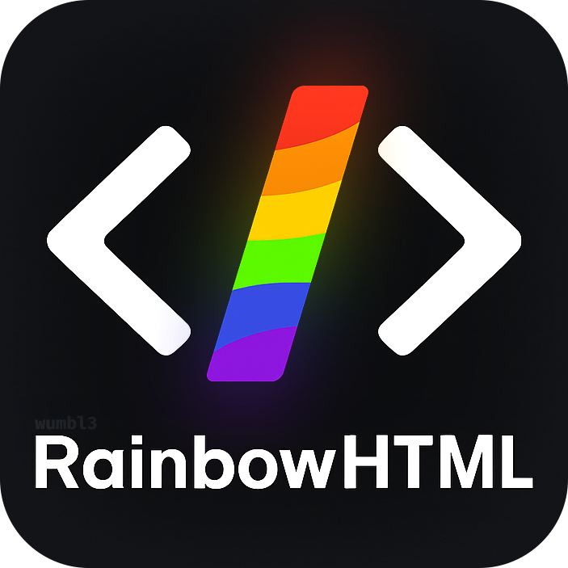
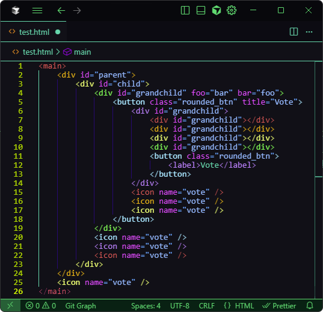

<div align="center">
  
  <h1 style="text-align:center;">Rainbow HTML</h1>
  <p align="center">Alternating rainbow foreground colors for HTML tag delimiters and tag names. Attributes and values remain untouched (uses theme's colors).</p>
    
</div>

## Features

-   Colors only `<`, `>`, optional `/`, and the tag name of each HTML element
-   Alternates through 6 rainbow colors (red, orange, yellow, green, blue, violet)
-   Works live as you type
-   Skips comments, doctype, and rawtext content (`<script>`, `<style>`) while still coloring their tags

## Supported languages

-   `html`
-   `javascript`, `typescript` (limited: scans html`...` tagged template literals)
-   `javascriptreact` (JSX), `typescriptreact` (TSX)

## Command

-   `Rainbow HTML: Refresh` (`rainbow-html.refresh`) — recompute decorations for the active editor

## Installation

-   Open VSX: search for `wumbl3.rainbow-html` in compatible editors (e.g., VS Code OSS, VSCodium)
-   VS Code Marketplace: search for `Rainbow HTML` by `wumbl3` (when published)

## Development

```bash
npm install
npm run watch
# Press F5 in VS Code to run the Extension Development Host
```

## License

MIT
