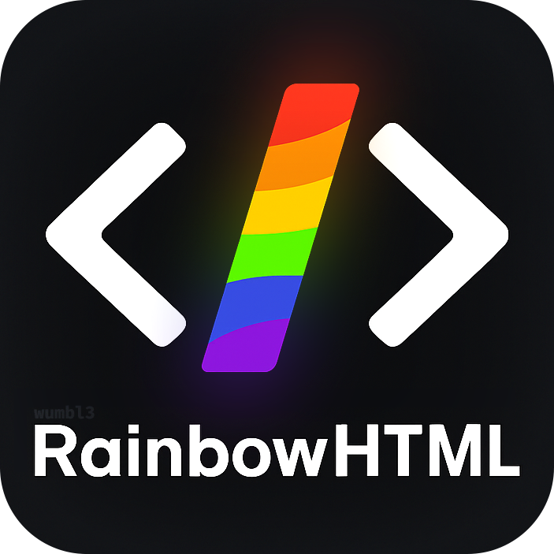
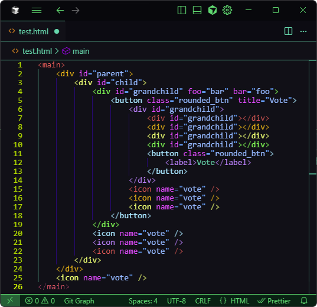

<div align="center">
  
  <h1 style="text-align:center;">Rainbow HTML</h1>
  <p align="center">Alternating rainbow foreground colors for HTML tag delimiters and tag names. Attributes and values remain untouched (uses theme's colors).</p>
    
</div>

## ✨ Features

- **Focused Syntax Highlighting**: Colors only `<`, `>`, optional `/`, and the tag name of each HTML element, leaving your theme's attribute and string colors undisturbed.
- **Alternating Rainbow Colors**: Cycles through 6 distinct rainbow colors (red, orange, yellow, green, blue, violet) for varying nested depths.
- **Live Updates**: Works instantly as you type to provide real-time structural feedback and readability.
- **Smart Parsing**: Intelligently pairs closing tags with opening tags to keep colors aligned across the same tree depth, and safely skips HTML comments, doctypes, and raw text content (like `<script>` and `<style>`) while still highlighting their outer tags.
- **Customizable File Types**: Expand functionality by adding your favorite templating languages (like Nunjucks, PHP, Svelte, Vue, Astro) to enjoy Rainbow HTML highlighting across your entire stack.

## 💻 Supported Languages

Out of the box, Rainbow HTML explicitly supports and highlights the following languages:

- **Web Core**: `html`, `.html`, `.htm`
- **React Ecosystem**: `javascriptreact` (JSX) and `typescriptreact` (TSX)
- **Vanilla JS/TS**: `javascript` and `typescript` (It intelligently scans for and highlights `html` tagged template literals, e.g., `html\`<div>...</div>\``)

Thanks to the new versatile extension configuration, standard web templates and frameworks are pre-configured in the `additionalFileTypes` setting:
- **Default Additional Types**: `njk`, `nunjucks`, `php`, `vue`, `svelte`, `astro`.

## ⚙️ Configuration Settings

You can fully customize the extension via your VS Code `settings.json` or the graphical Settings UI under **Rainbow HTML**.

- `rainbow-html.additionalFileTypes`: *(Array of Strings)*  
  A list of additional file extensions (e.g., `njk`) or VS Code language IDs (e.g., `nunjucks`) to actively scan for HTML tags.  
  *Default:* `["njk", "nunjucks", "php", "vue", "svelte", "astro"]`

## ⌨️ Commands

- `Rainbow HTML: Refresh` (`rainbow-html.refresh`)  
  Force the extension to immediately recompute and reapply syntax decorations for the currently active editor window.

## 🚀 Installation

### VS Code Marketplace
Search for **Rainbow HTML** via the Extensions pane in Visual Studio Code (publisher: `wumbl3`).

### Open VSX (VSCodium)
Search for `wumbl3.rainbow-html` in compatible editors like VSCodium or VS Code OSS.

## 🛠️ Development

To build and run the extension locally:

```bash
npm install
npm run watch
# Press F5 in VS Code to run the Extension Development Host debugger
```

## 📝 License

Released under the MIT License.
